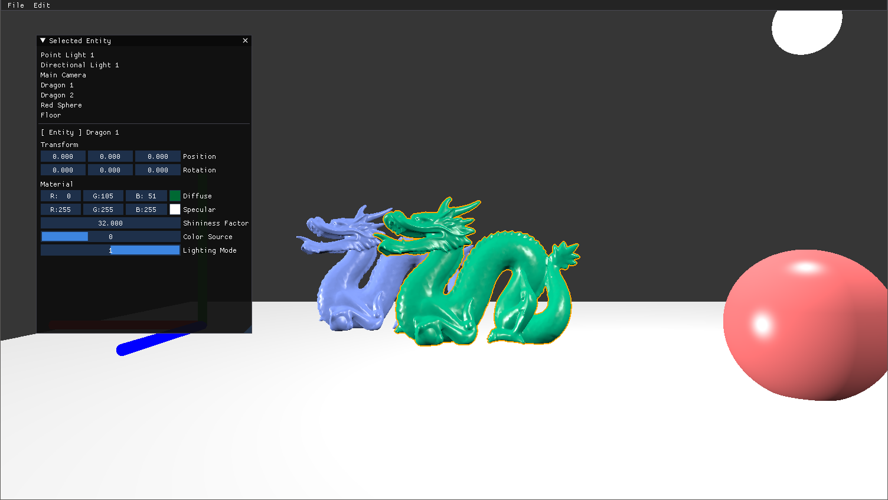

# Simple 3D Graphics Engine
A simple 3D graphics engine designed to serve as a tool for proof-of-concept algorithms



Documentation will be sparse and updated when major milestones are reached.

## Important Notes
- Events 
  - DO NOT modify components main data, ONLY state data
    - State data is akin to boolean and intergers
  - Cannot be stacked
  - work immediately across systems
- Actions: 
  - DO modify components. All data, including state data
  - Only happens during update
  - May be immediate or over time
  - Can be queued up by systems

https://github.com/ubuntunux/PyEngine3D

## High Performance Computing Sources
- https://www.taichi-lang.org/ (Very interesting)
- https://www.ray.io/
- https://numba.pydata.org/
- https://www.dask.org/

## Gizmo design ideas
https://projects.blender.org/blender/blender/issues/54661

## Gizmo sources
- https://github.com/john-chapman/im3d
- https://github.com/CedricGuillemet/ImGuizmo


## Python 3D graphics sources
- https://github.com/eth-ait/aitviewer
- https://github.com/mmatl/pyrender
- https://github.com/pygfx/pygfx
- https://github.com/3b1b/manim
- https://github.com/eliemichel/Python3dViewer
- https://github.com/ubuntunux/PyEngine3D

# Camera math and depth conversion
https://stackoverflow.com/questions/7777913/how-to-render-depth-linearly-in-modern-opengl-with-gl-fragcoord-z-in-fragment-sh

# How to count lines-of-code

https://codetabs.com/count-loc/count-loc-online.html

# 2D rendering to consider
- Use GLSL smoothstep for anti-alias effect when drawing 2D shapes using only the frament shader
- Use this for the 2D editor interface: https://www.shadertoy.com/view/fst3DH

# Useful Sources
- https://iquilezles.org/articles/intersectors/

## Insights on current engine inner workings
- WHen node's translation/rotation/scale is changed via
the setter, it sets the translation to None, and if None
when requested via a getter, it recalculates it just in time.
This is a flexible solution, but not a very efficient one.

## Shaders to study
https://shadered.org/view?s=0xMVU6DEAe

## ModernGL tips:
- Valid formats for VBO: ['f', 'f1', 'f2', 'f4', 'f8', 'u', 'u1', 'u2', 'u4', 'i', 'i1', 'i2', 'i4', 'nf', 'nf1', 'nf2', 'nf4', 'nu', 'nu1', 'nu2', 'nu4', 'ni', 'ni1', 'ni2', 'ni4']

## Optimisation TODOs:
- If a component/system does not handle any graphics, make it 100% Numba-complient
- Reduce number of uniform variable access. Maybe Uniform Array Object?
- Separate meshes by layer in list/array so we don't have to go over all objects. Alternatively, consider multi-layed meshes

## Linux installation

If you are getting this error when you try creating a context (most likely from moderngl.create_context()):
```commandline
Exception: (detect) glXGetCurrentContext: cannot detect OpenGL context
```
Do the following:
- List all the vailable drivers
```commandline
ubuntu-drivers devices
```
Pick the latest one that is compatible an run:
```commandline
sudo apt install nvidia-driver-name
```
Then Reboot
```commandline
sudo reboot
```
Then update the system
```commandline
sudo apt update
sudo apt upgrade
```
Install the mesa drivers
```commandline
sudo apt install mesa-utils
```
And reboot again
```commandline
sudo reboot
```
